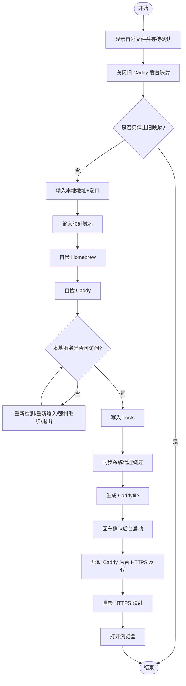

# **MacOS**@[**Caddy**](https://caddyserver.com/)<font color=red>本地域名 HTTPS 映射脚本</font>蓝皮书📘

<p align="left">
  <a></a>
  <a></a>
  <a></a>
  <a></a>
  <a></a>
</p>


[toc]

## 🔥 <font id=前言>前言</font>

- 采用 Shell 脚本的原因：Shell 来自 [**macOS**](https://www.apple.com/macos/) 原生系统底层，虽然写法相对繁琐冗杂，但执行效率高，并且不需要额外介入 [**Ruby**](https://www.ruby-lang.org)、[**Python**](https://www.python.org) 等第三方运行环境，因此具备更好的移植性。

> 当前脚本：`【MacOS】Caddy本地域名映射.command`

- 🔧 **工欲善其事必先利其器**
- 🌋 **站在巨人的肩膀上，才能看得更远**
- ✝️ **面向信仰编程**
- 🔔 **温馨提示**：本脚本用于把本机服务映射成 HTTPS 本地域名，例如：

  ```shell
  http://localhost:5173  ➤  https://jobs.pdf.com
  ```

## 一、🎯 脚本白皮书 <a href="#前言" style="font-size:17px; color:green;"><b>🔼</b></a> <a href="#🔚" style="font-size:17px; color:green;"><b>🔽</b></a>

本脚本用于 macOS 本地开发场景，自动完成 Caddy 自检安装、hosts 写入、代理绕过、Caddyfile 生成、HTTPS 证书信任和后台反向代理启动。

它只要求输入两个核心参数：

```shell
本地地址+端口
映射 URL 字符串名
```

示例：

```shell
本地地址+端口：localhost:5173
映射 URL 字符串名：jobs.pdf.com
```

最终访问：

```shell
https://jobs.pdf.com/
```

## 二、🧩 核心能力 <a href="#前言" style="font-size:17px; color:green;"><b>🔼</b></a> <a href="#🔚" style="font-size:17px; color:green;"><b>🔽</b></a>

### 1、启动保护 <a href="#前言" style="font-size:17px; color:green;"><b>🔼</b></a> <a href="#🔚" style="font-size:17px; color:green;"><b>🔽</b></a>

双击脚本后会先显示自述说明，并阻塞等待确认，避免误操作。

### 2、旧映射清理 <a href="#前言" style="font-size:17px; color:green;"><b>🔼</b></a> <a href="#🔚" style="font-size:17px; color:green;"><b>🔽</b></a>

确认自述文件后，脚本第一件事会关闭旧的 Caddy 后台映射，避免历史配置干扰。

如果只是想结束映射，可以再次运行脚本，确认自述文件后，在清理完成提示处输入：

```shell
q
```

即可只关闭旧映射并退出。

### 3、Homebrew 自检 <a href="#前言" style="font-size:17px; color:green;"><b>🔼</b></a> <a href="#🔚" style="font-size:17px; color:green;"><b>🔽</b></a>

脚本会自动检测 Homebrew：

- 未安装：按芯片架构安装 Homebrew
- 已安装：询问是否升级

升级逻辑统一为：

```shell
直接按 [Enter]：跳过升级
输入任意字符后回车：执行升级
```

### 4、Caddy 自检 <a href="#前言" style="font-size:17px; color:green;"><b>🔼</b></a> <a href="#🔚" style="font-size:17px; color:green;"><b>🔽</b></a>

脚本会自动检测 Caddy：

- 未安装：通过 Homebrew 安装
- 已安装：询问是否升级

升级逻辑同样是：

```shell
直接按 [Enter]：跳过升级
输入任意字符后回车：执行升级
```

## 三、🚀 使用方法 <a href="#前言" style="font-size:17px; color:green;"><b>🔼</b></a> <a href="#🔚" style="font-size:17px; color:green;"><b>🔽</b></a>

### 1、双击运行 <a href="#前言" style="font-size:17px; color:green;"><b>🔼</b></a> <a href="#🔚" style="font-size:17px; color:green;"><b>🔽</b></a>

双击：

```shell
【MacOS】Caddy本地域名映射.command
```

按提示输入：

```shell
本地地址+端口：localhost:5173
映射 URL 字符串名：jobs.pdf.com
```

### 2、命令行传参 <a href="#前言" style="font-size:17px; color:green;"><b>🔼</b></a> <a href="#🔚" style="font-size:17px; color:green;"><b>🔽</b></a>

```shell
"/path/to/【MacOS】Caddy本地域名映射.command" "localhost:5173" "jobs.pdf.com"
```

### 3、只停止旧映射 <a href="#前言" style="font-size:17px; color:green;"><b>🔼</b></a> <a href="#🔚" style="font-size:17px; color:green;"><b>🔽</b></a>

```shell
"/path/to/【MacOS】Caddy本地域名映射.command" --stop
```

或者双击运行脚本，确认自述文件后，在旧映射清理完成提示处输入：

```shell
q
```

## 四、🧪 Stirling-PDF / Vite 场景 <a href="#前言" style="font-size:17px; color:green;"><b>🔼</b></a> <a href="#🔚" style="font-size:17px; color:green;"><b>🔽</b></a>

如果目标服务是 Vite，建议启动服务时仍显式加入 allowed host：

```shell
cd /Users/jobs/Documents/Github/Stirling-PDF
__VITE_ADDITIONAL_SERVER_ALLOWED_HOSTS=jobs.pdf.com task frontend:dev
```

然后运行本脚本：

```shell
本地地址+端口：http://localhost:5173
映射 URL 字符串名：jobs.pdf.com
```

脚本会把 `localhost` 自动规整为 `127.0.0.1`，避免 Caddy 优先访问 `::1` 导致 502。

## 五、🧭 流程图 <a href="#前言" style="font-size:17px; color:green;"><b>🔼</b></a> <a href="#🔚" style="font-size:17px; color:green;"><b>🔽</b></a>



## 六、🔍 常用排查命令 <a href="#前言" style="font-size:17px; color:green;"><b>🔼</b></a> <a href="#🔚" style="font-size:17px; color:green;"><b>🔽</b></a>

### 1、检查域名解析 <a href="#前言" style="font-size:17px; color:green;"><b>🔼</b></a> <a href="#🔚" style="font-size:17px; color:green;"><b>🔽</b></a>

```shell
dscacheutil -q host -a name jobs.pdf.com
```

期望看到：

```shell
ip_address: 127.0.0.1
```

### 2、检查 Caddy 监听 <a href="#前言" style="font-size:17px; color:green;"><b>🔼</b></a> <a href="#🔚" style="font-size:17px; color:green;"><b>🔽</b></a>

```shell
sudo lsof -nP -iTCP:443 -sTCP:LISTEN
```

期望看到：

```shell
caddy ... TCP *:443 (LISTEN)
```

### 3、检查 HTTPS 映射 <a href="#前言" style="font-size:17px; color:green;"><b>🔼</b></a> <a href="#🔚" style="font-size:17px; color:green;"><b>🔽</b></a>

```shell
curl -vk https://jobs.pdf.com/
```

### 4、检查本地服务 <a href="#前言" style="font-size:17px; color:green;"><b>🔼</b></a> <a href="#🔚" style="font-size:17px; color:green;"><b>🔽</b></a>

```shell
curl -I http://127.0.0.1:5173/
```

如果这里不通，Caddy 映射必然会 502。

## 七、⚠️ 注意事项 <a href="#前言" style="font-size:17px; color:green;"><b>🔼</b></a> <a href="#🔚" style="font-size:17px; color:green;"><b>🔽</b></a>

- Caddy 只负责映射，不负责启动你的本地项目。
- 本地服务必须先启动，脚本才会继续创建映射。
- 如果使用 `.com`，必须依赖 `/etc/hosts` 指向本机。
- 如果浏览器走系统代理，脚本会自动把映射域名加入代理绕过列表。
- 如果目标服务是 Vite，仍建议显式设置 allowed host。
- Caddy 启动后是后台服务，关闭终端不会影响映射。

## 八、日志文件

运行日志默认写入 `/tmp`，文件名通常来自脚本名去掉扩展名：

```shell
/tmp/【MacOS】Caddy本地域名映射.log
```

<a id="🔚" href="#前言" style="font-size:17px; color:green; font-weight:bold;">我是有底线的➤点我回到首页</a>
