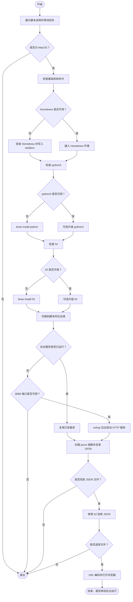

# `JobsMockData`

<p align="left">
  <a></a>
  <a></a>
  <a></a>
  <a></a>
  <a></a>
</p>

> 将本地电脑作为一个轻量级 **Mock JSON HTTP 服务**，让前端、iOS、Android、Flutter、调试页面都可以像请求真实接口一样读取本地 JSON 数据。脚本启动后服务在后台运行，终端窗口可以直接关闭。


[toc]

## 🔥 <font id=前言>前言</font>

> 当前总行数：612

* 🔧 **工欲善其事必先利其器**

* 🌋 **Mock 的核心价值不是“造假数据”，而是把接口依赖从别人手里拿回来**

* ✝️ **面向信仰编程**

* 这个项目对应 `【MacOS】Mock.command`，用于在 **MacOS** 上快速启动一个本地 JSON 接口服务。

* 脚本底层使用的是 Python 自带的 HTTP 服务能力：

  ```shell
  python3 -m http.server 8080 --bind 127.0.0.1
  ```

* 但它不是只执行一条命令这么简单。脚本还额外做了：

  * 检查并接入 [**Homebrew**](https://brew.sh/)
  * 检查并安装 / 升级 `python3`
  * 检查并安装 / 升级 `fzf`
  * 后台启动本地 HTTP 服务
  * 记录 PID，支持 `start` / `stop` / `status` / `restart`
  * 优先扫描 `jsons/` 目录下的 `.json` 文件
  * 使用 `fzf` 交互选择 JSON 文件
  * 对中文、空格等路径自动做 URL 编码
  * 自动打开浏览器访问选中的 JSON 地址

* 默认服务地址：

  ```url
  http://127.0.0.1:8080
  ```

* 默认只绑定本机回环地址 `127.0.0.1`，这比直接暴露到局域网更安全。真机设备想访问时，需要额外处理 Mac 局域网 IP、端口、防火墙和服务绑定地址。

---

## 一、🎯 项目定位 <a href="#前言" style="font-size:17px; color:green;"><b>🔼</b></a> <a href="#🔚" style="font-size:17px; color:green;"><b>🔽</b></a>

`JobsMockData` 的目标很明确：**把一堆本地 JSON 文件变成本地可请求的 HTTP 接口**。

适合这些场景：

* 后端接口还没完成，但前端 / App 页面需要先开发。
* 真实接口不稳定、数据不方便反复造、联调环境经常挂。
* 需要固定返回数据，稳定复现某个 UI、分页、列表、空数据、异常数据场景。
* 需要给别人一个本地 Mock 包，让对方双击脚本后直接访问 JSON。
* App 开发时，临时把 `https://api.xxx.com/user/list` 这种接口替换成本地 JSON 地址。

它不适合这些场景：

* 不适合生产部署。
* 不负责模拟复杂鉴权、Cookie、Token 刷新、网关转发。
* 不负责根据请求参数动态返回不同 JSON。
* 不负责 POST / PUT / DELETE 业务逻辑；Python 静态服务器主要用于静态文件读取。

一句话：**这是一个轻量、可控、低成本的本地静态 JSON Mock 服务。**

---

## 二、📦 目录结构 <a href="#前言" style="font-size:17px; color:green;"><b>🔼</b></a> <a href="#🔚" style="font-size:17px; color:green;"><b>🔽</b></a>

当前压缩包解开后，核心结构如下：

```text
【MacOS】Mock. command/
├── icon.png
├── LICENSE
├── README.md
├── 【MacOS】Mock.command
└── jsons/
    ├── CityList.json
    ├── CommentData.json
    ├── Countries.json
    ├── CountryList.json
    ├── IdTypeList.json
    ├── IncomeSource.json
    ├── OccupationList.json
    ├── Philippines.json
    ├── UserData.json
    ├── data.json
    ├── users.json
    └── 假数据.json
```

重点说明：

| 路径 | 作用 |
|---|---|
| `【MacOS】Mock.command` | 主脚本，双击或终端运行它 |
| `jsons/` | 默认 JSON 数据目录，脚本优先扫描这里 |
| `README.md` | 当前说明文档 |
| `LICENSE` | 授权文件 |
| `icon.png` | 图标资源 |

如果 `jsons/` 目录存在，脚本只优先展示 `jsons/` 目录下的 JSON 文件；如果 `jsons/` 不存在，才会回退扫描脚本所在目录。

---

## 三、🚀 快速开始 <a href="#前言" style="font-size:17px; color:green;"><b>🔼</b></a> <a href="#🔚" style="font-size:17px; color:green;"><b>🔽</b></a>

### 3.1、授权脚本 <a href="#前言" style="font-size:17px; color:green;"><b>🔼</b></a> <a href="#🔚" style="font-size:17px; color:green;"><b>🔽</b></a>

首次下载后，如果系统提示脚本没有执行权限，在终端进入脚本目录后执行：

```shell
chmod +x './【MacOS】Mock.command'
```

如果 macOS 因为下载来源拦截执行，可以移除隔离属性：

```shell
xattr -dr com.apple.quarantine './【MacOS】Mock.command'
```

然后再运行：

```shell
./【MacOS】Mock.command
```

---

### 3.2、启动 Mock 服务 <a href="#前言" style="font-size:17px; color:green;"><b>🔼</b></a> <a href="#🔚" style="font-size:17px; color:green;"><b>🔽</b></a>

双击 `【MacOS】Mock.command`，或者在终端执行：

```shell
./【MacOS】Mock.command
```

等价于：

```shell
./【MacOS】Mock.command start
```

启动后脚本会依次完成：

* 展示脚本说明并等待回车。
* 检查当前是否为 **MacOS**。
* 检查基础系统命令是否存在。
* 检查 / 安装 / 接入 [**Homebrew**](https://brew.sh/)。
* 检查 / 安装 / 可选升级 `python3`。
* 检查 / 安装 / 可选升级 `fzf`。
* 切换到脚本所在目录。
* 使用 `nohup` 后台启动本地 HTTP 服务。
* 优先扫描 `jsons/` 目录下的 `.json` 文件。
* 使用 `fzf` 选择一个 JSON 文件。
* 自动打开浏览器访问选中的 JSON。
* 脚本退出，但 HTTP 服务继续在后台运行。

---

### 3.3、常用管理命令 <a href="#前言" style="font-size:17px; color:green;"><b>🔼</b></a> <a href="#🔚" style="font-size:17px; color:green;"><b>🔽</b></a>

```shell
# 启动服务，并交互选择 JSON
./【MacOS】Mock.command start

# 查看服务状态
./【MacOS】Mock.command status

# 停止后台服务
./【MacOS】Mock.command stop

# 重启服务，并重新选择 JSON
./【MacOS】Mock.command restart

# 查看帮助
./【MacOS】Mock.command help
```

命令说明：

| 命令 | 说明 |
|---|---|
| `start` | 启动后台服务，并通过 `fzf` 选择 JSON 后打开浏览器 |
| `status` | 查看服务是否运行、PID、日志文件位置 |
| `stop` | 根据 PID 文件停止本脚本启动的 HTTP 服务 |
| `restart` | 先停止，再重新执行完整启动流程 |
| `help` / `-h` / `--help` | 查看脚本帮助 |

---

## 四、🧭 工作流程 <a href="#前言" style="font-size:17px; color:green;"><b>🔼</b></a> <a href="#🔚" style="font-size:17px; color:green;"><b>🔽</b></a>

### 4.1、流程图 <a href="#前言" style="font-size:17px; color:green;"><b>🔼</b></a> <a href="#🔚" style="font-size:17px; color:green;"><b>🔽</b></a>



---

### 4.2、核心启动链路 <a href="#前言" style="font-size:17px; color:green;"><b>🔼</b></a> <a href="#🔚" style="font-size:17px; color:green;"><b>🔽</b></a>

脚本真正启动 HTTP 服务的核心命令是：

```shell
nohup python3 -m http.server 8080 --bind 127.0.0.1 >"$HTTP_LOG_FILE" 2>&1 < /dev/null &
```

这意味着：

* `python3 -m http.server`：使用 Python 内置静态 HTTP 服务。
* `8080`：固定监听本地 `8080` 端口。
* `--bind 127.0.0.1`：只允许本机访问。
* `nohup`：终端关闭后服务不跟着退出。
* `PID_FILE`：脚本会记录后台进程 PID，方便后续停止。
* `HTTP_LOG_FILE`：服务输出会写入独立日志文件。

---

## 五、🌐 访问方式 <a href="#前言" style="font-size:17px; color:green;"><b>🔼</b></a> <a href="#🔚" style="font-size:17px; color:green;"><b>🔽</b></a>

### 5.1、浏览器访问 <a href="#前言" style="font-size:17px; color:green;"><b>🔼</b></a> <a href="#🔚" style="font-size:17px; color:green;"><b>🔽</b></a>

启动后，服务根地址是：

```url
http://127.0.0.1:8080/
```

如果选择的是：

```text
jsons/users.json
```

那么访问地址就是：

```url
http://127.0.0.1:8080/jsons/users.json
```

如果文件名包含中文，例如：

```text
jsons/假数据.json
```

脚本会自动 URL 编码，打开类似下面的地址：

```url
http://127.0.0.1:8080/jsons/%E5%81%87%E6%95%B0%E6%8D%AE.json
```

---

### 5.2、App 里请求 <a href="#前言" style="font-size:17px; color:green;"><b>🔼</b></a> <a href="#🔚" style="font-size:17px; color:green;"><b>🔽</b></a>

在本机调试或 iOS 模拟器里，可以直接使用：

```swift
let url = URL(string: "http://127.0.0.1:8080/jsons/users.json")!
```

或者：

```swift
let url = URL(string: "http://localhost:8080/jsons/users.json")!
```

如果是真机访问，当前脚本默认绑定 `127.0.0.1`，真机通常访问不到。真机联调需要满足这些条件：

* Mac 和手机在同一个局域网。
* 使用 Mac 的局域网 IP，例如 `http://192.168.x.x:8080/jsons/users.json`。
* macOS 防火墙允许该端口访问。
* 服务监听地址不能只绑定 `127.0.0.1`。

也就是说，当前版本默认更偏向 **本机 / 模拟器调试**，不是局域网共享服务器。

---

## 六、🧩 脚本能力说明 <a href="#前言" style="font-size:17px; color:green;"><b>🔼</b></a> <a href="#🔚" style="font-size:17px; color:green;"><b>🔽</b></a>

### 6.1、MacOS 限制 <a href="#前言" style="font-size:17px; color:green;"><b>🔼</b></a> <a href="#🔚" style="font-size:17px; color:green;"><b>🔽</b></a>

脚本开头会检测系统：

```shell
uname -s
```

只有结果为 `Darwin` 时才继续。Linux / Windows / WSL 不是当前脚本的目标环境。

---

### 6.2、Homebrew 检测逻辑 <a href="#前言" style="font-size:17px; color:green;"><b>🔼</b></a> <a href="#🔚" style="font-size:17px; color:green;"><b>🔽</b></a>

脚本会按顺序寻找：

| 检测路径 | 说明 |
|---|---|
| `command -v brew` | 当前环境已经能直接找到 `brew` |
| `/opt/homebrew/bin/brew` | Apple Silicon 常见路径 |
| `/usr/local/bin/brew` | Intel 常见路径 |

如果未检测到 [**Homebrew**](https://brew.sh/)，脚本会使用官方安装命令安装：

```shell
/bin/bash -c "$(curl -fsSL https://raw.githubusercontent.com/Homebrew/install/HEAD/install.sh)"
```

安装或检测到 brew 后，会把 shellenv 写入当前 Shell 对应配置文件：

| Shell | 配置文件 |
|---|---|
| `zsh` | `~/.zprofile` |
| `bash` | `~/.bash_profile` |
| 其他 | `~/.profile` |

写入内容类似：

```shell
eval "$(/opt/homebrew/bin/brew shellenv)"
```

脚本使用带标记的配置块写入，避免重复追加同一段配置。

---

### 6.3、依赖安装策略 <a href="#前言" style="font-size:17px; color:green;"><b>🔼</b></a> <a href="#🔚" style="font-size:17px; color:green;"><b>🔽</b></a>

脚本会检查两个核心依赖：

| 命令 | brew 包 | 作用 |
|---|---|---|
| `python3` | `python` | 提供本地 HTTP 静态服务 |
| `fzf` | `fzf` | 交互选择 JSON 文件 |

如果命令不存在，就自动安装。

如果命令已经存在，脚本会询问是否升级：

| 输入 | 行为 |
|---|---|
| 直接按回车 | 跳过升级 |
| 输入任意字符后回车 | 执行升级流程 |

这个设计比较务实：默认不强制升级，避免每次启动都被 `brew upgrade` 拖慢。

---

### 6.4、端口与进程策略 <a href="#前言" style="font-size:17px; color:green;"><b>🔼</b></a> <a href="#🔚" style="font-size:17px; color:green;"><b>🔽</b></a>

脚本固定使用：

| 项 | 值 |
|---|---|
| Host | `127.0.0.1` |
| Port | `8080` |
| 服务类型 | Python 静态 HTTP Server |
| 启动方式 | `nohup` 后台启动 |

如果 PID 文件存在且进程还活着，脚本会认为服务已经运行，不会重复启动。

如果 `8080` 被其他进程占用，脚本会拒绝继续，并打印端口占用信息。它不会粗暴 kill 其他进程，这一点是对的，避免误杀别的服务。

---

### 6.5、JSON 文件选择策略 <a href="#前言" style="font-size:17px; color:green;"><b>🔼</b></a> <a href="#🔚" style="font-size:17px; color:green;"><b>🔽</b></a>

扫描规则：

| 条件 | 行为 |
|---|---|
| 存在 `jsons/` 目录 | 扫描 `jsons/` 下所有 `.json` 文件 |
| 不存在 `jsons/` 目录 | 回退扫描脚本所在目录下所有 `.json` 文件 |
| 没有找到 JSON | 提示后退出，不启动浏览器选择 |
| 用户未选择 JSON | 脚本结束，服务仍可能已经在后台运行 |

选择界面来自：

```shell
fzf --prompt='请选择一个 JSON 文件: ' --height=40% --reverse
```

---

## 七、🧪 添加自己的 Mock 数据 <a href="#前言" style="font-size:17px; color:green;"><b>🔼</b></a> <a href="#🔚" style="font-size:17px; color:green;"><b>🔽</b></a>

推荐把自己的 JSON 文件放进 `jsons/` 目录：

```text
jsons/
├── users.json
├── products.json
├── order_detail.json
└── empty_list.json
```

然后重新运行：

```shell
./【MacOS】Mock.command restart
```

或者服务已经运行时，直接访问新文件路径：

```url
http://127.0.0.1:8080/jsons/products.json
```

推荐命名习惯：

| 场景 | 文件名示例 |
|---|---|
| 用户列表 | `users.json` |
| 用户详情 | `user_detail.json` |
| 商品列表 | `products.json` |
| 空列表 | `empty_list.json` |
| 错误数据 | `error_case.json` |
| 分页第一页 | `page_1.json` |
| 分页第二页 | `page_2.json` |

不要把文件名写得太玄学。Mock 数据最重要的是让人一眼看懂它服务于哪个接口、哪个场景。

---

## 八、🧾 日志与运行文件 <a href="#前言" style="font-size:17px; color:green;"><b>🔼</b></a> <a href="#🔚" style="font-size:17px; color:green;"><b>🔽</b></a>

脚本会把日志和 PID 文件写在 `/tmp` 目录：

| 文件 | 说明 |
|---|---|
| `/tmp/【MacOS】Mock.log` | 主脚本日志 |
| `/tmp/【MacOS】Mock_http_server.log` | Python HTTP 服务日志 |
| `/tmp/【MacOS】Mock_http_server.pid` | 后台服务 PID 文件 |

实际文件名由脚本自身文件名决定。如果你重命名了 `【MacOS】Mock.command`，日志文件名也会跟着变化。

查看状态：

```shell
./【MacOS】Mock.command status
```

查看 HTTP 服务日志：

```shell
tail -f /tmp/【MacOS】Mock_http_server.log
```

查看主脚本日志：

```shell
tail -f /tmp/【MacOS】Mock.log
```

---

## 九、🧯 常见问题 <a href="#前言" style="font-size:17px; color:green;"><b>🔼</b></a> <a href="#🔚" style="font-size:17px; color:green;"><b>🔽</b></a>

### 9.1、提示没有执行权限 <a href="#前言" style="font-size:17px; color:green;"><b>🔼</b></a> <a href="#🔚" style="font-size:17px; color:green;"><b>🔽</b></a>

执行：

```shell
chmod +x './【MacOS】Mock.command'
```

然后重新运行。

---

### 9.2、提示无法打开，因为无法验证开发者 <a href="#前言" style="font-size:17px; color:green;"><b>🔼</b></a> <a href="#🔚" style="font-size:17px; color:green;"><b>🔽</b></a>

执行：

```shell
xattr -dr com.apple.quarantine './【MacOS】Mock.command'
```

或者在系统设置里手动允许该脚本运行。

---

### 9.3、8080 端口被占用 <a href="#前言" style="font-size:17px; color:green;"><b>🔼</b></a> <a href="#🔚" style="font-size:17px; color:green;"><b>🔽</b></a>

先看状态：

```shell
./【MacOS】Mock.command status
```

如果是本脚本启动的服务，可以停止：

```shell
./【MacOS】Mock.command stop
```

如果是其他程序占用，可以手动检查：

```shell
lsof -nP -iTCP:8080 -sTCP:LISTEN
```

不要盲目 `kill -9`。先确认进程是什么，否则容易误杀别的开发服务。

---

### 9.4、fzf 选择后没有打开 JSON <a href="#前言" style="font-size:17px; color:green;"><b>🔼</b></a> <a href="#🔚" style="font-size:17px; color:green;"><b>🔽</b></a>

常见原因：

* 没有选中文件，直接退出了 `fzf`。
* JSON 文件不在 `jsons/` 目录，也不在脚本扫描范围内。
* 文件后缀不是 `.json`。
* 浏览器被系统拦截。

可以直接手动访问：

```url
http://127.0.0.1:8080/jsons/users.json
```

---

### 9.5、真机访问不到 <a href="#前言" style="font-size:17px; color:green;"><b>🔼</b></a> <a href="#🔚" style="font-size:17px; color:green;"><b>🔽</b></a>

这是当前脚本的预期行为之一。因为它绑定的是：

```text
127.0.0.1
```

`127.0.0.1` 只代表当前设备自己。手机访问自己的 `127.0.0.1`，不是访问你的 Mac。

真机联调需要改成局域网可访问方案。当前 README 不建议你直接暴露服务，除非你明确知道自己在做什么。

---

## 十、🛡️ 使用建议 <a href="#前言" style="font-size:17px; color:green;"><b>🔼</b></a> <a href="#🔚" style="font-size:17px; color:green;"><b>🔽</b></a>

* Mock 数据建议尽量小而清晰，不要把整套生产数据塞进来。
* 不要提交真实用户隐私、手机号、证件号、Token、Cookie。
* JSON 文件最好按接口或场景命名，别只叫 `data1.json`、`test.json`。
* 列表、详情、空数据、异常数据建议分开维护。
* 需要复现 UI 问题时，把对应 JSON 固定下来，比反复依赖远程接口稳定得多。
* 当前脚本默认绑定本机地址，安全性比局域网开放更高；如果以后要支持真机联调，建议另开一个明确的 `--lan` 参数，而不是默认暴露。

---

## 十一、📌 README 升级说明 <a href="#前言" style="font-size:17px; color:green;"><b>🔼</b></a> <a href="#🔚" style="font-size:17px; color:green;"><b>🔽</b></a>

本次 README 做了这些升级：

* 按统一格式补充 `🔥 <font id=前言>前言</font>`。
* 所有章节标题追加顶部 / 底部跳转按钮。
* 文末追加“我是有底线的➤点我回到首页”。
* 修正旧 README 中命令名不一致的问题：当前脚本文件是 `【MacOS】Mock.command`，不是 `【MacOS】Mock_后台版.command`。
* 补充真实脚本流程：环境自检、Homebrew、python3、fzf、后台服务、PID、日志、JSON 选择、URL 编码。
* 补充端口占用、真机访问、权限拦截、日志排查等常见问题。
* 明确这个项目是本地静态 JSON Mock 服务，不是生产部署服务。

---

<a id="🔚" href="#前言" style="font-size:17px; color:green; font-weight:bold;">我是有底线的➤点我回到首页</a>
