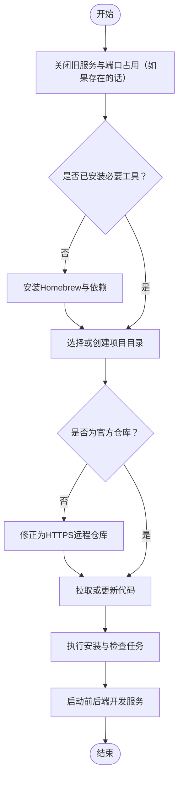
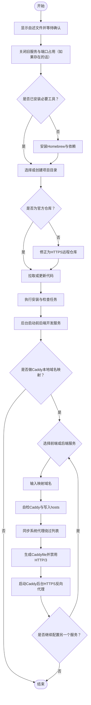

# **MacOS** [**Stirling-PDF**](https://www.stirling.com)本地部署+[**Caddy**](https://caddyserver.com)本地端口域名映射

<p align="left">
  <a href="https://www.stirling.com"></a>
  <a href="https://caddyserver.com"></a>
  <a href="https://brew.sh/"></a>
  <a></a>
  <a></a>
  <a></a>
</p>


[toc]

## 🔥 <font id=前言>前言</font>

> 当前总行数：

* 🔧 **工欲善其事必先利其器**

* 🌋 **站在巨人的肩膀上，才能看得更远**

* ✝️ **面向信仰编程**

* 📚 **参考来源**：[**Stirling-PDF**](https://www.stirling.com)｜[**Caddy**](https://caddyserver.com)｜[**Homebrew**](https://brew.sh/)

* 🔔 **温馨提示**：本文较长，直接访问 [**Github**](https://github.com/) 可能无法完整阅读全文

  * 推荐下载到本地阅读，推荐阅读器 ➤ [**Typora**](https://typora.io/)

  * 或者使用 [**Google Chrom**e](https://www.google.com/chrome/) 浏览器安装 `Markdown Preview Plus` 插件并启用

* 本脚本用于在 macOS 上自动完成 [**Stirling-PDF**](https://www.stirling.com) 本地开发部署，并在服务启动完成后，可选接入 [**Caddy**](https://caddyserver.com) 本地域名 HTTPS 映射。

* [**Caddy**](https://caddyserver.com) 映射启动后会在后台运行，关闭终端窗口不会影响映射继续生效。若需要结束映射，可重新运行脚本；脚本在用户确认自述文件后，会优先关闭旧的后台映射。

## 一、🎯 项目白皮书 <a href="#前言" style="font-size:17px; color:green;"><b>🔼</b></a> <a href="#🔚" style="font-size:17px; color:green;"><b>🔽</b></a>

这个脚本解决的是完整的本地部署与本地域名访问链路：

* 自动准备 macOS 开发依赖
* 自动选择、创建或复用 [**Stirling-PDF**](https://www.stirling.com) 本地仓库
* 自动校验官方仓库来源
* 自动修正远程仓库地址为 HTTPS
* 自动拉取或更新代码
* 自动执行安装与检查任务
* 自动后台启动前端与后端开发服务
* 可选使用 [**Caddy**](https://caddyserver.com) 把本地端口映射成本地域名 HTTPS 访问地址

最终本地服务默认如下：

| 服务 | 默认地址 | 说明 |
| --- | --- | --- |
| 前端 | `http://localhost:5173` | 浏览器主入口 |
| 后端 | `http://localhost:8080` | API 服务入口 |
| 域名映射 | `https://你的域名` | 由 [**Caddy**](https://caddyserver.com) 反向代理到本地端口 |

## 二、🧭 脚本执行流程 <a href="#前言" style="font-size:17px; color:green;"><b>🔼</b></a> <a href="#🔚" style="font-size:17px; color:green;"><b>🔽</b></a>

基础部署主流程如下：



这个流程图作为 [**Stirling-PDF**](https://www.stirling.com) 本地部署主干是正确的。融合 [**Caddy**](https://caddyserver.com) 后，脚本在 `启动前后端开发服务` 之后增加了可选的本地域名映射流程：



## 三、🧩 功能清单 <a href="#前言" style="font-size:17px; color:green;"><b>🔼</b></a> <a href="#🔚" style="font-size:17px; color:green;"><b>🔽</b></a>

### 1、启动前置说明

脚本双击运行后，会先显示完整自述文件，并等待用户按回车确认。这样可以避免误触后直接修改系统环境、端口占用或后台服务。

### 2、旧服务清理

脚本会主动清理旧的 [**Stirling-PDF**](https://www.stirling.com) 后台服务、前端端口、后端端口，以及旧的 [**Caddy**](https://caddyserver.com) 后台映射，避免历史进程影响本次启动。

### 3、开发环境自检

脚本会自检：

* <font Color=red>**X**</font>code <font Color=blue>**C**</font>ommand Line <font Color=green>**T**</font>ools
* `git`
* `clang`
* `make`
* [**Homebrew**](https://brew.sh/)
* `node`
* `jenv`
* `openjdk@21`
* `uv`
* `go-task`
* [**Caddy**](https://caddyserver.com)

其中 [**Homebrew**](https://brew.sh/) 未安装时会按芯片架构自动安装；已安装时会询问是否升级。

### 4、统一升级交互规范

所有升级类操作统一使用以下规则：

```text
直接按 [Enter]：跳过升级
输入任意字符后回车：执行升级
```

这个规则适用于 [**Homebrew**](https://brew.sh/)、`node`、`jenv`、`openjdk@21`、`uv`、`go-task`、[**Caddy**](https://caddyserver.com) 等依赖。

### 5、源码目录选择

脚本会优先读取本地记录文件，复用上次成功验证过的项目目录。如果没有记录或记录失效，则会要求用户输入或拖入目录。

目录选择逻辑：

* 直接按回车：继续询问，不会误用空路径
* 输入一个空格后回车：使用桌面目录
* 输入或拖入路径：校验父目录是否存在
* 末级项目目录不存在时：自动创建

### 6、官方仓库校验

脚本会校验当前目录是否为官方 [**Stirling-PDF**](https://www.stirling.com) 仓库。

如果发现 remote 是 SSH 地址，会统一修正为 HTTPS 地址，避免后续机器环境、密钥、权限差异导致拉取失败。

### 7、安装与检查任务

源码准备完成后，脚本会执行：

```shell
task install
task check
```

这一步用于完成项目依赖准备、格式检查、测试检查等流程。若上游项目任务本身发生变化，请以当前仓库内 `Taskfile` 为准。

### 8、前后端开发服务

脚本会后台启动：

```shell
task backend:dev
task frontend:dev
```

默认服务地址：

```text
前端：http://localhost:5173
后端：http://localhost:8080
```

日志文件默认位于：

```text
后端日志：~/Library/Logs/Stirling-PDF-Dev/backend.log
前端日志：~/Library/Logs/Stirling-PDF-Dev/frontend.log
```

## 四、🌐 [**Caddy**](https://caddyserver.com) 本地域名映射 <a href="#前言" style="font-size:17px; color:green;"><b>🔼</b></a> <a href="#🔚" style="font-size:17px; color:green;"><b>🔽</b></a>

### 1、映射入口

前后端服务启动完成后，脚本会询问：

```text
是否做 Caddy 本地域名 HTTPS 映射处理？
直接按 [Enter]：默认做映射
输入任意字符后回车：跳过映射，结束战斗
```

选择做映射后，脚本会继续询问先配置哪一个：

```text
1. 前端：http://localhost:5173
2. 后端：http://localhost:8080
```

配置完一个以后，不会立刻退出，会继续询问是否配置另一个服务。

### 2、域名输入

示例：

```text
jobs.pdf.com
jobs.pdf.test
api.pdf.test
```

`.com` 是公网 TLD，本机开发依赖 `/etc/hosts`，长期本地开发更建议使用 `.test`。

### 3、hosts 写入

脚本会写入：

```text
127.0.0.1 你的映射域名
```

并刷新 macOS DNS 缓存，确保浏览器能解析到本机。

### 4、系统代理绕过

如果系统存在代理、VPN、Clash、Surge、LetsVPN 等网络环境，浏览器可能不走本机 hosts。脚本会把映射域名加入 macOS 系统代理绕过列表，降低 SSL 异常、代理污染、错误公网解析的概率。

### 5、[**Caddy**](https://caddyserver.com) 反向代理

脚本会生成 [**Caddy**](https://caddyserver.com) 配置文件，并使用：

```text
tls internal
reverse_proxy
```

完成本地 HTTPS 反向代理。

同时脚本会禁用 HTTP/3，只保留 HTTP/1.1 和 HTTP/2，降低 Chrome、代理、QUIC 在本地域名环境下的干扰。

### 6、后台运行

[**Caddy**](https://caddyserver.com) 使用后台方式启动。

启动成功后可以直接关闭终端窗口，映射仍会继续生效。

如果要结束映射，可以重新运行脚本。脚本在用户确认自述文件后，会优先停止旧的 [**Caddy**](https://caddyserver.com) 后台映射。

## 五、🧪 常用自检命令 <a href="#前言" style="font-size:17px; color:green;"><b>🔼</b></a> <a href="#🔚" style="font-size:17px; color:green;"><b>🔽</b></a>

### 1、检查前端服务

```shell
curl -I http://127.0.0.1:5173/
lsof -nP -iTCP:5173 -sTCP:LISTEN
```

### 2、检查后端服务

```shell
curl -v http://127.0.0.1:8080/api/v1/info/status
lsof -nP -iTCP:8080 -sTCP:LISTEN
```

### 3、检查域名解析

```shell
dscacheutil -q host -a name jobs.pdf.com
```

期望看到：

```text
ip_address: 127.0.0.1
```

### 4、检查 [**Caddy**](https://caddyserver.com)

```shell
sudo lsof -nP -iTCP:443 -sTCP:LISTEN
sudo lsof -nP -iTCP:2019 -sTCP:LISTEN
```

正常情况下，`443` 应该由 [**Caddy**](https://caddyserver.com) 监听。

### 5、检查 HTTPS 映射

```shell
curl -vk https://jobs.pdf.com/
curl -vk https://jobs.pdf.com/api/v1/info/status
```

如果后端映射成功，通常可以看到类似：

```json
{"status":"UP"}
```

## 六、⚠️ 常见问题 <a href="#前言" style="font-size:17px; color:green;"><b>🔼</b></a> <a href="#🔚" style="font-size:17px; color:green;"><b>🔽</b></a>

### 1、浏览器显示 502

通常表示 [**Caddy**](https://caddyserver.com) 启动成功，但目标本地端口没有服务。

检查：

```shell
curl -I http://127.0.0.1:5173/
curl -v http://127.0.0.1:8080/api/v1/info/status
```

### 2、浏览器提示 Host 不允许

如果目标服务是 Vite，可能需要 allowed host。

脚本针对 [**Stirling-PDF**](https://www.stirling.com) 前端映射时，会自动尝试注入：

```shell
__VITE_ADDITIONAL_SERVER_ALLOWED_HOSTS=你的映射域名
```

如果你手动启动前端，也可以这样执行：

```shell
__VITE_ADDITIONAL_SERVER_ALLOWED_HOSTS=jobs.pdf.com task frontend:dev
```

### 3、Chrome 报 SSL 协议错误

优先检查系统代理绕过列表：

```shell
scutil --proxy
```

确认映射域名已加入绕过列表，例如：

```text
jobs.pdf.com
*.pdf.com
```

### 4、443 端口被占用

检查：

```shell
sudo lsof -nP -iTCP:443 -sTCP:LISTEN
```

如果不是 [**Caddy**](https://caddyserver.com)，需要先停止占用 443 的服务。

### 5、关闭终端后还能访问吗？

可以。

[**Caddy**](https://caddyserver.com) 映射以后台方式运行，关闭终端窗口不会影响 HTTPS 映射。

但 [**Stirling-PDF**](https://www.stirling.com) 前后端服务也必须保持后台运行；如果前端或后端进程被关闭，对应页面或接口会变成 502 或连接失败。

## 七、🧹 停止与清理 <a href="#前言" style="font-size:17px; color:green;"><b>🔼</b></a> <a href="#🔚" style="font-size:17px; color:green;"><b>🔽</b></a>

### 1、停止本地服务

脚本保留停止参数：

```shell
"脚本路径" --stop
```

该流程用于清理 [**Stirling-PDF**](https://www.stirling.com) 后台服务、端口占用以及 [**Caddy**](https://caddyserver.com) 后台映射。

### 2、手动停止 [**Caddy**](https://caddyserver.com)

```shell
sudo caddy stop
```

### 3、查看日志

```shell
cat /tmp/StirlingPDF.log
tail -n 120 ~/Library/Logs/Stirling-PDF-Dev/backend.log
tail -n 120 ~/Library/Logs/Stirling-PDF-Dev/frontend.log
```

## 八、✅ 总结 <a href="#前言" style="font-size:17px; color:green;"><b>🔼</b></a> <a href="#🔚" style="font-size:17px; color:green;"><b>🔽</b></a>

这个脚本把 [**Stirling-PDF**](https://www.stirling.com) 本地开发部署和 [**Caddy**](https://caddyserver.com) 本地域名 HTTPS 映射整合到同一套流程中。

核心目标是：

* 让本地环境从零到可访问
* 让前端、后端服务自动启动
* 让本地域名 HTTPS 映射可选启用
* 让 [**Caddy**](https://caddyserver.com) 后台运行，关闭终端也不影响映射
* 让再次运行脚本时可以自动清理旧映射，避免历史配置干扰

<a id="🔚" href="#前言" style="font-size:17px; color:green; font-weight:bold;">我是有底线的➤点我回到首页</a>
