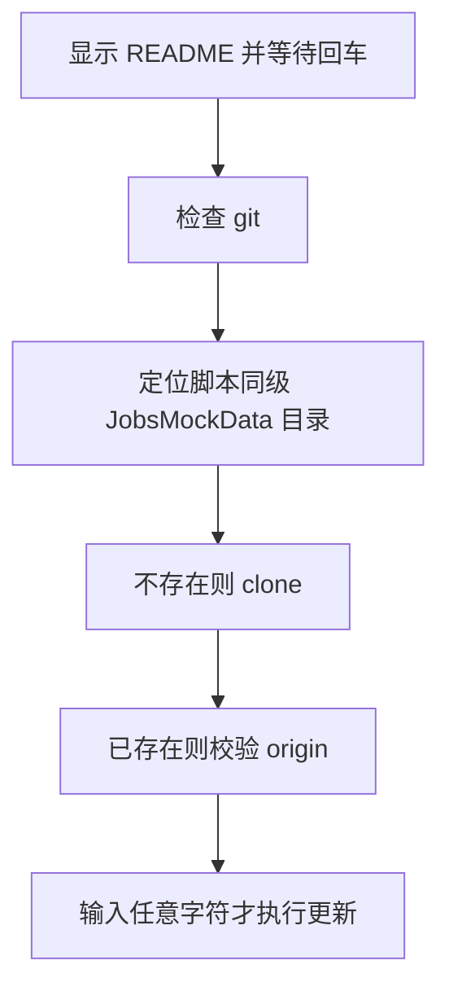

# `【MacOS】⏬下载Mock数据.command` <a href="#前言" style="font-size:17px; color:green;"><b>🔼</b></a> <a href="#🔚" style="font-size:17px; color:green;"><b>🔽</b></a>


[toc]

## 🔥 <font id=前言>前言</font>

> 当前总行数：

* 🔧**工欲善其事必先利其器**

* 🌋 **站在巨人的肩膀上，才能看得更远**

* ✝️ **面向信仰编程**

* 🔔 **温馨提示**：这个自述文件和同目录脚本是一一对应关系。双击脚本后，会先打印本文件内容并阻塞等待回车，避免误操作。

* 脚本日志默认写入：

  ```shell
  /tmp/【MacOS】⏬下载Mock数据.log
  ```

## 一、🎯 脚本定位 <a href="#前言" style="font-size:17px; color:green;"><b>🔼</b></a> <a href="#🔚" style="font-size:17px; color:green;"><b>🔽</b></a>

**JobsMockData 下载 / 更新脚本**

用于把 JobsKits/JobsMockData 仓库下载到脚本同级目录；如果仓库已存在，则按需执行 pull --rebase --autostash。

## 二、🧩 适用场景 <a href="#前言" style="font-size:17px; color:green;"><b>🔼</b></a> <a href="#🔚" style="font-size:17px; color:green;"><b>🔽</b></a>

* 首次下载 Mock 数据仓库。
* 本地已有仓库，需要手动选择是否同步远程更新。
* 配合本地 Mock 服务脚本使用。

## 三、🚀 快速开始 <a href="#前言" style="font-size:17px; color:green;"><b>🔼</b></a> <a href="#🔚" style="font-size:17px; color:green;"><b>🔽</b></a>

双击当前 `.command` 文件即可运行；也可以在终端中执行：

```shell
chmod +x './【MacOS】⏬下载Mock数据.command'
./【MacOS】⏬下载Mock数据.command
```

> 运行后先阅读终端打印的 README，确认无误后按回车继续。

## 四、🧭 工作流程 <a href="#前言" style="font-size:17px; color:green;"><b>🔼</b></a> <a href="#🔚" style="font-size:17px; color:green;"><b>🔽</b></a>



## 五、⚠️ 注意事项 <a href="#前言" style="font-size:17px; color:green;"><b>🔼</b></a> <a href="#🔚" style="font-size:17px; color:green;"><b>🔽</b></a>

* 需要访问 GitHub。
* 目标目录存在但不是 Git 仓库时会拒绝覆盖。
* 更新时如发生冲突，需要进入仓库手动处理。

## 六、📁 文件结构 <a href="#前言" style="font-size:17px; color:green;"><b>🔼</b></a> <a href="#🔚" style="font-size:17px; color:green;"><b>🔽</b></a>

```text
【MacOS】⏬下载Mock数据.command/
├── 【MacOS】⏬下载Mock数据.command
└── README.md
```

## 七、🪵 日志位置 <a href="#前言" style="font-size:17px; color:green;"><b>🔼</b></a> <a href="#🔚" style="font-size:17px; color:green;"><b>🔽</b></a>

```shell
/tmp/【MacOS】⏬下载Mock数据.log
```

<a id="🔚" href="#前言" style="font-size:17px; color:green; font-weight:bold;">我是有底线的➤点我回到首页</a>
