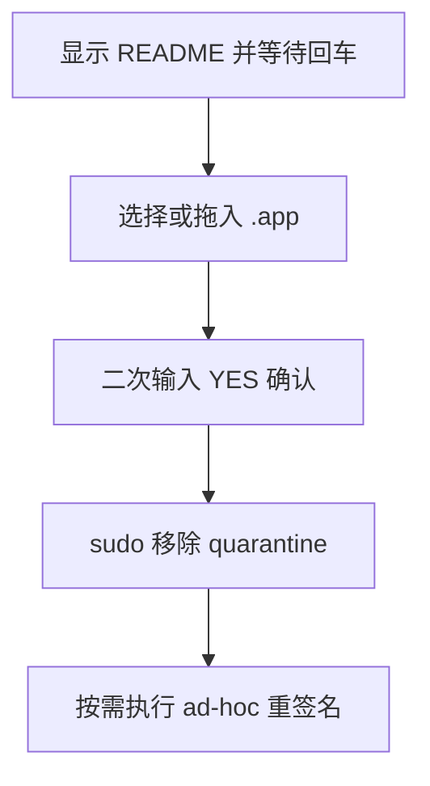

# `【MacOS】⚙️『 已损坏，无法打开: 来自身份不明的开发者』等问题修复工具.command` <a href="#前言" style="font-size:17px; color:green;"><b>🔼</b></a> <a href="#🔚" style="font-size:17px; color:green;"><b>🔽</b></a>


[toc]

## 🔥 <font id=前言>前言</font>

> 当前总行数：

* 🔧**工欲善其事必先利其器**

* 🌋 **站在巨人的肩膀上，才能看得更远**

* ✝️ **面向信仰编程**

* 🔔 **温馨提示**：这个自述文件和同目录脚本是一一对应关系。双击脚本后，会先打印本文件内容并阻塞等待回车，避免误操作。

* 脚本日志默认写入：

  ```shell
  /tmp/【MacOS】⚙️『 已损坏，无法打开: 来自身份不明的开发者』等问题修复工具.log
  ```

## 一、🎯 脚本定位 <a href="#前言" style="font-size:17px; color:green;"><b>🔼</b></a> <a href="#🔚" style="font-size:17px; color:green;"><b>🔽</b></a>

**Mac App 隔离属性修复脚本**

用于移除可信 App 的 com.apple.quarantine 隔离属性，必要时可选择 ad-hoc 重签名。新版不再默认关闭全局 Gatekeeper。

## 二、🧩 适用场景 <a href="#前言" style="font-size:17px; color:green;"><b>🔼</b></a> <a href="#🔚" style="font-size:17px; color:green;"><b>🔽</b></a>

* 打开 App 时提示“已损坏，无法打开”。
* App 来自身份不明开发者，但你确认来源可信。
* 需要对单个 .app 做隔离属性修复。

## 三、🚀 快速开始 <a href="#前言" style="font-size:17px; color:green;"><b>🔼</b></a> <a href="#🔚" style="font-size:17px; color:green;"><b>🔽</b></a>

双击当前 `.command` 文件即可运行；也可以在终端中执行：

```shell
chmod +x './【MacOS】⚙️『 已损坏，无法打开: 来自身份不明的开发者』等问题修复工具.command'
./【MacOS】⚙️『 已损坏，无法打开: 来自身份不明的开发者』等问题修复工具.command
```

> 运行后先阅读终端打印的 README，确认无误后按回车继续。

## 四、🧭 工作流程 <a href="#前言" style="font-size:17px; color:green;"><b>🔼</b></a> <a href="#🔚" style="font-size:17px; color:green;"><b>🔽</b></a>



## 五、⚠️ 注意事项 <a href="#前言" style="font-size:17px; color:green;"><b>🔼</b></a> <a href="#🔚" style="font-size:17px; color:green;"><b>🔽</b></a>

* 需要管理员密码。
* 只对你信任来源的 App 使用。
* 重签名可能影响部分 App 的完整性校验，所以默认跳过。

## 六、📁 文件结构 <a href="#前言" style="font-size:17px; color:green;"><b>🔼</b></a> <a href="#🔚" style="font-size:17px; color:green;"><b>🔽</b></a>

```text
【MacOS】⚙️『 已损坏，无法打开: 来自身份不明的开发者』等问题修复工具.command/
├── 【MacOS】⚙️『 已损坏，无法打开: 来自身份不明的开发者』等问题修复工具.command
└── README.md
```

## 七、🪵 日志位置 <a href="#前言" style="font-size:17px; color:green;"><b>🔼</b></a> <a href="#🔚" style="font-size:17px; color:green;"><b>🔽</b></a>

```shell
/tmp/【MacOS】⚙️『 已损坏，无法打开: 来自身份不明的开发者』等问题修复工具.log
```

<a id="🔚" href="#前言" style="font-size:17px; color:green; font-weight:bold;">我是有底线的➤点我回到首页</a>
