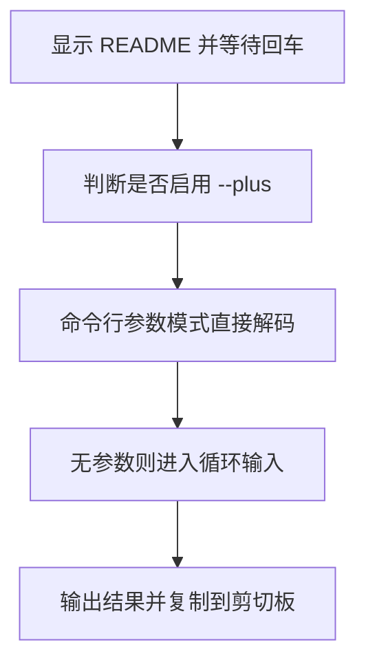

# `【MacOS】去乱码.command` <a href="#前言" style="font-size:17px; color:green;"><b>🔼</b></a> <a href="#🔚" style="font-size:17px; color:green;"><b>🔽</b></a>


[toc]

## 🔥 <font id=前言>前言</font>

- 采用 Shell 脚本的原因：Shell 来自 [**macOS**](https://www.apple.com/macos/) 原生系统底层，虽然写法相对繁琐冗杂，但执行效率高，并且不需要额外介入 [**Ruby**](https://www.ruby-lang.org)、[**Python**](https://www.python.org) 等第三方运行环境，因此具备更好的移植性。

> 当前总行数：

- 🔧**工欲善其事必先利其器**

- 🌋 **站在巨人的肩膀上，才能看得更远**

- ✝️ **面向信仰编程**

- 🔔 **温馨提示**：这个自述文件和同目录脚本是一一对应关系。双击脚本后，会先打印本文件内容并阻塞等待回车，避免误操作。

- 脚本日志默认写入：

  ```shell
  $TMPDIR/【MacOS】去乱码.log
  ```

## 一、🎯 脚本定位 <a href="#前言" style="font-size:17px; color:green;"><b>🔼</b></a> <a href="#🔚" style="font-size:17px; color:green;"><b>🔽</b></a>

**URL 编码解码脚本**

用于把 `%E7%...` 这类 URL 编码字符串解码为中文或可读文本，并复制到剪切板。

## 二、🧩 适用场景 <a href="#前言" style="font-size:17px; color:green;"><b>🔼</b></a> <a href="#🔚" style="font-size:17px; color:green;"><b>🔽</b></a>

- 从浏览器、日志、接口参数中拿到 URL 编码文本。
- 需要快速解码中文路径或 query 参数。
- 需要把 + 当空格解析时可传入 --plus。

## 三、🚀 快速开始 <a href="#前言" style="font-size:17px; color:green;"><b>🔼</b></a> <a href="#🔚" style="font-size:17px; color:green;"><b>🔽</b></a>

双击当前 `.command` 文件即可运行；也可以在终端中执行：

```shell
chmod +x './【MacOS】去乱码.command'
./【MacOS】去乱码.command --plus "%E4%BD%A0%E5%A5%BD+Jobs"
```

> 运行后先阅读终端打印的 README，确认无误后按回车继续。

## 四、🧭 工作流程 <a href="#前言" style="font-size:17px; color:green;"><b>🔼</b></a> <a href="#🔚" style="font-size:17px; color:green;"><b>🔽</b></a>



## 五、⚠️ 注意事项 <a href="#前言" style="font-size:17px; color:green;"><b>🔼</b></a> <a href="#🔚" style="font-size:17px; color:green;"><b>🔽</b></a>

- 依赖 python3 或 ruby。
- 只做解码，不会修改文件。

## 六、📁 文件结构 <a href="#前言" style="font-size:17px; color:green;"><b>🔼</b></a> <a href="#🔚" style="font-size:17px; color:green;"><b>🔽</b></a>

```text
【MacOS】去乱码.command/
├── 【MacOS】去乱码.command
└── README.md
```

## 七、🪵 日志位置 <a href="#前言" style="font-size:17px; color:green;"><b>🔼</b></a> <a href="#🔚" style="font-size:17px; color:green;"><b>🔽</b></a>

```shell
$TMPDIR/【MacOS】去乱码.log
```

<a id="🔚" href="#前言" style="font-size:17px; color:green; font-weight:bold;">我是有底线的➤点我回到首页</a>
