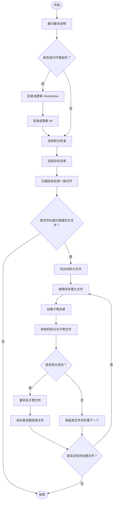
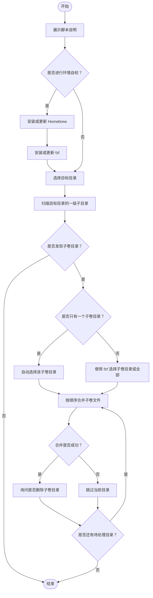
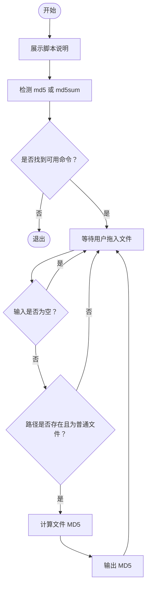

# **MacOS 文件子卷工具脚本说明**


[toc]

## 一、前言

- 这个自述文件对应三个 MacOS `.command` 脚本：

  ```text
  【MacOS】✂️源文件压缩拆分➤子卷.command
  【MacOS】🧩子卷➤合而为一源文件.command
  【MacOS】🧬MD5.command
  ```

- 这三个脚本是一组本地文件处理工具，主要用于：

  * 把大文件按指定体积拆成多个子卷文件。
  * 把拆出来的子卷文件重新合并成源文件。
  * 计算文件的 MD5，方便人工核对文件一致性。

- 其中 `【MacOS】✂️源文件压缩拆分➤子卷.command` 名字里带有“压缩”，但按当前脚本实现来看，它实际执行的是 **二进制拆分**，不是 ZIP / tar / 7z 这种压缩归档。也就是说，文件内容不会被压缩，只会被按体积切分。

- 如果你确实想“先压缩、再拆分”，建议先手动生成 `.zip`、`.tar.gz` 或其他压缩包，再把压缩包交给拆分脚本处理。

- 拆分脚本默认使用 `50 MB` 作为保守拆分标准，也可以选择 `100 MiB`、GitHub Releases 安全标准或自定义 MB 数值。

- 合并脚本依赖拆分脚本生成的命名规则。不要手动改动子卷文件名，否则合并脚本可能无法正确识别顺序和源文件名。

- 有交互选择需求时，脚本会使用 [**fzf**](https://github.com/junegunn/fzf)；环境准备依赖 [**Homebrew**](https://brew.sh/)。

- 流程图可以复制到 [**ProcessOn**](https://www.processon.com/) 或支持 Mermaid 的 Markdown 工具中查看。

---

## 二、脚本总览

| 脚本 | 作用 | 是否需要 Homebrew | 是否需要 fzf | 主要输出 |
|---|---|---|---|---|
| `【MacOS】✂️源文件压缩拆分➤子卷.command` | 扫描目标目录中的大文件，并拆分为多个子卷 | 可选自检安装 | 可选，用于选择拆分标准 | 子卷目录 |
| `【MacOS】🧩子卷➤合而为一源文件.command` | 扫描子卷目录，并合并为源文件 | 可选自检安装 | 多个子卷目录时建议安装 | 合并后的源文件 |
| `【MacOS】🧬MD5.command` | 计算文件 MD5 | 不需要 | 不需要 | MD5 字符串 |

---

## 三、工作流程

### 3.1、赋予执行权限

三个脚本首次下载后，建议先赋予执行权限：

```shell
chmod +x './【MacOS】✂️源文件压缩拆分➤子卷.command'
chmod +x './【MacOS】🧩子卷➤合而为一源文件.command'
chmod +x './【MacOS】🧬MD5.command'
```

---

### 3.2、拆分大文件

运行：

```shell
./'【MacOS】✂️源文件压缩拆分➤子卷.command'
```

正常流程：

- 展示脚本说明。
- 询问是否进行环境自检。
- 选择拆分标准。
- 选择目标目录。
- 扫描目标目录一级文件。
- 找出超过拆分标准的大文件。
- 为每个大文件创建子卷目录。
- 使用 `split` 按体积拆分。
- 重命名子卷文件。
- 拆分成功后询问是否删除源文件。

---

### 3.3、合并子卷文件

运行：

```shell
./'【MacOS】🧩子卷➤合而为一源文件.command'
```

正常流程：

- 展示脚本说明。
- 询问是否进行环境自检。
- 选择目标目录。
- 扫描目标目录下的一级子目录。
- 找出包含 `@` 子卷标记的目录。
- 如果只有一个子卷目录，自动处理。
- 如果有多个子卷目录，通过 `fzf` 选择要合并的目录。
- 按文件名顺序合并子卷。
- 输出合并后的源文件到目标目录。
- 合并成功后询问是否删除子卷目录。

---

### 3.4、计算文件 MD5

运行：

```shell
./'【MacOS】🧬MD5.command'
```

正常流程：

- 展示脚本说明。
- 自动检测系统中可用的 `md5` 或 `md5sum`。
- 拖入文件路径。
- 输出 MD5。
- 继续等待下一个文件。

注意：当前脚本实际行为是 **空输入不会退出**，会继续等待输入；如果要退出，请按：

```text
Ctrl+C
```

---

## 四、`【MacOS】✂️源文件压缩拆分➤子卷.command` 详细说明

### 4.1、流程简述



---

### 4.2、脚本定位

`【MacOS】✂️源文件压缩拆分➤子卷.command` 用于把目标目录中的大文件拆成多个较小的子卷文件。

它适合这些场景：

- 文件太大，不适合直接提交到 GitHub 普通仓库。
- 文件太大，不方便通过聊天工具、网盘、邮件等渠道传输。
- 想把一个大文件拆成多个固定大小附近的小文件。
- 需要和合并脚本配套使用，后续恢复成原始文件。

注意：当前实现不做压缩，只做拆分。

---

### 4.3、环境自检

脚本启动后会询问是否进行环境自检：

| 输入 | 行为 |
|---|---|
| 直接按 `[Enter]` | 跳过环境自检，直接开始工作 |
| 输入任意字符后回车 | 执行 Homebrew / fzf 自检、安装或升级 |

环境自检包含：

- 检查 [**Homebrew**](https://brew.sh/) 是否存在。
- 不存在时，根据 CPU 架构安装 Homebrew。
- 已存在时，询问是否更新 Homebrew。
- 检查 [**fzf**](https://github.com/junegunn/fzf) 是否存在。
- 不存在时，通过 Homebrew 安装 fzf。
- 已存在时，询问是否升级 fzf。

---

### 4.4、Homebrew 自检逻辑

脚本会先检查：

```shell
command -v brew
```

如果没有检测到 Homebrew，会根据 CPU 架构执行官方安装脚本：

```shell
/bin/bash -c "$(curl -fsSL https://raw.githubusercontent.com/Homebrew/install/HEAD/install.sh)"
```

安装路径按架构区分：

| Mac 类型 | Homebrew 常见路径 |
|---|---|
| Apple Silicon | `/opt/homebrew/bin/brew` |
| Intel | `/usr/local/bin/brew` |

安装完成后，脚本会向当前 Shell 的配置文件注入 `brew shellenv`：

| Shell | 写入文件 |
|---|---|
| `zsh` | `~/.zprofile` |
| `bash` | `~/.bash_profile` |
| 其他 | `~/.profile` |

写入内容类似：

```shell
eval "$(/opt/homebrew/bin/brew shellenv)"
```

或：

```shell
eval "$(/usr/local/bin/brew shellenv)"
```

如果 Homebrew 已安装，脚本会询问是否更新：

| 输入 | 行为 |
|---|---|
| 直接按 `[Enter]` | 执行 `brew update`、`brew upgrade`、`brew cleanup`、`brew doctor`、`brew -v` |
| 输入任意字符后回车 | 跳过 Homebrew 更新 |

这个交互和很多脚本习惯相反：这里是 **回车更新，输入内容跳过**。

---

### 4.5、fzf 自检逻辑

脚本会检查：

```shell
command -v fzf
```

如果没有检测到 fzf，会执行：

```shell
brew install fzf
```

如果 fzf 已安装，脚本会询问是否升级：

| 输入 | 行为 |
|---|---|
| 直接按 `[Enter]` | 执行 `brew upgrade fzf` 和 `brew cleanup` |
| 输入任意字符后回车 | 跳过 fzf 升级 |

fzf 的作用主要是提供更舒服的交互选择，例如选择拆分标准。

---

### 4.6、拆分标准

脚本支持四种拆分标准：

| 选项 | 实际大小 | 说明 |
|---|---:|---|
| `50MB` | `50 * 1024 * 1024` 字节 | 脚本默认保守标准 |
| `100MiB` | `100 * 1024 * 1024` 字节 | GitHub 普通仓库阻止线附近 |
| `2GB` | `1900 * 1024 * 1024` 字节 | GitHub Releases / LFS 场景下的安全上限 |
| `CUSTOM` | 用户输入的 MB 数值 | 自定义拆分大小 |

有 fzf 时，脚本会弹出选择列表：

```text
50MB    脚本当前标准（警告线，默认）
100MiB  GitHub 仓库限制线标准
2GB     GitHub Releases 标准
CUSTOM  自定义标准（单位：MB）
```

没有 fzf 时，会回退为数字输入模式：

| 输入 | 行为 |
|---|---|
| 直接按 `[Enter]` | 使用 `50 MB` |
| `1` | 使用 `100 MiB` |
| `2` | 使用 GitHub Releases 安全标准，即 `1900 MiB` |
| `3` | 输入自定义 MB 数值 |
| 其他 | 回退为 `50 MB` |

---

### 4.7、目标目录选择

脚本会要求拖入或输入目标目录：

```text
请拖入要处理的【目标目录】，然后回车。
```

交互规则：

| 输入 | 行为 |
|---|---|
| 直接按 `[Enter]` | 使用脚本所在目录 |
| 拖入 / 输入目录路径 | 使用该目录作为目标目录 |
| 输入无效路径 | 报错并退出 |
| 输入文件路径 | 报错并退出 |

脚本只扫描目标目录的一级文件，不递归扫描子目录。

---

### 4.8、扫描规则

脚本会执行类似下面的扫描逻辑：

```shell
find "$TARGET_DIR" -maxdepth 1 -type f
```

只有满足下面条件的文件才会被拆分：

- 是普通文件。
- 位于目标目录一级。
- 文件大小大于当前拆分标准。

不会处理：

- 子目录里的文件。
- 目录。
- 符号链接目录。
- 小于或等于拆分标准的文件。

---

### 4.9、子卷目录命名规则

对于源文件：

```text
Example.zip
```

脚本会创建目录：

```text
Example/
```

规则是：

- 取源文件名。
- 如果文件名包含后缀，去掉最后一个后缀。
- 使用去掉后缀后的名称作为子卷目录名。

示例：

| 源文件 | 子卷目录 |
|---|---|
| `Video.mp4` | `Video/` |
| `Archive.zip` | `Archive/` |
| `Backup.tar.gz` | `Backup.tar/` |
| `LargeFile` | `LargeFile/` |

---

### 4.10、子卷文件命名规则

拆分后的子卷文件命名格式是：

```text
原文件名@当前序号of总序号
```

例如：

```text
Example.zip@001of005
Example.zip@002of005
Example.zip@003of005
Example.zip@004of005
Example.zip@005of005
```

说明：

| 字段 | 说明 |
|---|---|
| `Example.zip` | 原始文件名 |
| `@` | 子卷标记 |
| `001` | 当前子卷序号 |
| `005` | 总子卷数 |

序号会自动补零，方便按字典序排序。

---

### 4.11、实际拆分方式

脚本使用系统 `split` 命令进行拆分：

```shell
split -b "$actual_chunk_size_bytes" -d -a 3 -- "$file" "$tmp_prefix"
```

重点：

- `-b`：按字节大小拆分。
- `-d`：使用数字后缀。
- `-a 3`：临时后缀长度为 3。
- 拆分后会再重命名为脚本自己的 `@001of005` 格式。

脚本不是简单粗暴地每个子卷都等于上限大小，而是会根据文件大小计算一个较均衡的实际主卷大小，尽量避免最后一个子卷特别小。

---

### 4.12、拆分成功后是否删除源文件

每个文件拆分成功后，脚本会询问：

| 输入 | 行为 |
|---|---|
| 直接按 `[Enter]` | 删除源文件 |
| 输入任意字符后回车 | 保留源文件 |

这是高危操作。

建议第一次使用时输入任意字符保留源文件，确认合并脚本能正常还原后，再手动删除源文件。

---

### 4.13、注意事项

- 文件名中最好不要包含 `@`，因为合并脚本会用 `@` 判断子卷标记。
- 不要手动修改子卷文件名。
- 不要删掉任何一个子卷，否则合并脚本会跳过该目录。
- 不要把不同源文件的子卷混进同一个子卷目录。
- 拆分脚本不会写校验文件，如果需要强校验，请配合 MD5 脚本使用。
- 当前脚本不压缩文件，只拆分文件。

---

## 五、`【MacOS】🧩子卷➤合而为一源文件.command` 详细说明

### 5.1、流程简述



---

### 5.2、脚本定位

`【MacOS】🧩子卷➤合而为一源文件.command` 用于把拆分脚本生成的子卷目录重新合并成源文件。

它适合这些场景：

- 已经拿到一组 `@001of005`、`@002of005` 这类子卷文件。
- 想从子卷文件恢复原始文件。
- 想批量处理目标目录下的多个子卷目录。
- 想在合并成功后选择是否删除子卷目录。

---

### 5.3、环境自检

脚本启动后会询问是否进行环境自检：

| 输入 | 行为 |
|---|---|
| 直接按 `[Enter]` | 跳过环境自检，直接开始工作 |
| 输入任意字符后回车 | 执行 Homebrew / fzf 自检、安装或升级 |

如果目标目录下只有一个子卷目录，即使没有 fzf，也可以自动处理。

如果目标目录下有多个子卷目录，脚本会调用 fzf 进行选择；这种情况下建议先执行环境自检，确保 fzf 已安装。

---

### 5.4、目标目录选择

脚本会要求拖入或输入目标目录：

```text
请拖入要处理的【目标目录】，然后回车。
```

交互规则：

| 输入 | 行为 |
|---|---|
| 直接按 `[Enter]` | 使用脚本所在目录 |
| 拖入 / 输入目录路径 | 使用该目录作为目标目录 |
| 输入无效路径 | 报错并退出 |
| 输入文件路径 | 报错并退出 |

目标目录应该是子卷目录的上级目录。

推荐结构：

```text
Target/
├── Example/
│   ├── Example.zip@001of005
│   ├── Example.zip@002of005
│   ├── Example.zip@003of005
│   ├── Example.zip@004of005
│   └── Example.zip@005of005
└── Other/
    ├── Other.dmg@001of003
    ├── Other.dmg@002of003
    └── Other.dmg@003of003
```

合并完成后，输出文件会放在目标目录：

```text
Target/
├── Example.zip
├── Other.dmg
├── Example/
└── Other/
```

---

### 5.5、子卷目录识别规则

脚本只扫描目标目录的一级子目录：

```shell
for dir in "$TARGET_DIR"/*; do
  [[ -d "$dir" ]] || continue
done
```

如果某个一级子目录里存在文件名包含 `@` 的普通文件，就会被认为是疑似子卷目录。

例如：

```text
Example/
├── Example.zip@001of005
└── Example.zip@002of005
```

会被识别。

但下面这种不会被递归识别：

```text
Target/
└── A/
    └── B/
        ├── Example.zip@001of005
        └── Example.zip@002of005
```

因为子卷目录不在目标目录的一级。

---

### 5.6、子卷目录选择

识别到子卷目录后，脚本会分两种情况：

| 情况 | 行为 |
|---|---|
| 只检测到 1 个子卷目录 | 自动选择并处理 |
| 检测到多个子卷目录 | 使用 fzf 选择一个目录，或选择全部目录 |

多个目录时，fzf 里会出现：

```text
【全部子卷目录】
子卷目录A
子卷目录B
子卷目录C
```

如果选择 `【全部子卷目录】`，脚本会依次合并所有识别到的子卷目录。

---

### 5.7、合并规则

合并脚本会读取子卷目录中所有文件名包含 `@` 的普通文件：

```text
Example.zip@001of005
Example.zip@002of005
Example.zip@003of005
```

然后按 shell glob 默认字典序合并。

这也是拆分脚本为什么使用补零序号的原因：

```text
001
002
003
...
010
011
```

补零之后，字典序和实际卷序一致。

---

### 5.8、源文件名推断规则

合并脚本会从第一个子卷文件名中提取源文件名：

```text
Example.zip@001of005
```

提取结果：

```text
Example.zip
```

规则是：

```text
取第一个 @ 之前的内容
```

所以源文件名本身最好不要包含 `@`。

如果原始文件名是：

```text
A@B.zip
```

拆分后可能是：

```text
A@B.zip@001of005
```

合并脚本会把源文件名误判为：

```text
A
```

这就是为什么不建议源文件名包含 `@`。

---

### 5.9、总卷数校验

合并脚本会从第一个子卷文件的后缀中解析总卷数。

例如：

```text
Example.zip@001of005
```

会解析出总卷数：

```text
5
```

然后对比目录中的实际子卷数量。

| 状态 | 行为 |
|---|---|
| 标记总数等于实际数量 | 继续合并 |
| 标记总数不等于实际数量 | 警告并跳过该目录 |
| 无法解析总数 | 不做总数校验，继续尝试合并 |

如果缺少某个子卷，脚本会跳过，避免生成明显不完整的文件。

---

### 5.10、目标文件已存在时的处理

如果目标目录中已经存在同名输出文件，脚本会询问：

| 输入 | 行为 |
|---|---|
| 直接按 `[Enter]` | 覆盖现有文件 |
| 输入任意字符后回车 | 跳过当前子卷目录 |

这是高危操作。

建议第一次合并时先确认目标目录里没有同名文件，避免误覆盖。

---

### 5.11、合并成功后是否删除子卷目录

每个目录合并成功后，脚本会询问：

| 输入 | 行为 |
|---|---|
| 直接按 `[Enter]` | 删除子卷目录 |
| 输入任意字符后回车 | 保留子卷目录 |

建议先保留子卷目录，使用 MD5 或手动打开文件确认无误后，再删除。

---

### 5.12、注意事项

- 子卷目录必须位于目标目录一级。
- 多个子卷目录时建议安装 fzf。
- 不要修改子卷文件名。
- 不要混入无关的 `@` 文件。
- 源文件名最好不要包含 `@`。
- 合并脚本不计算 MD5，不保证内容语义正确，只负责按字节拼接。
- 合并后建议使用 MD5 脚本核对文件一致性。

---

## 六、`【MacOS】🧬MD5.command` 详细说明

### 6.1、流程简述



---

### 6.2、脚本定位

`【MacOS】🧬MD5.command` 用于计算文件 MD5。

它适合这些场景：

- 拆分前计算源文件 MD5。
- 合并后计算输出文件 MD5。
- 对比两个文件是否字节一致。
- 记录文件校验值，方便跨机器核对。

---

### 6.3、MD5 工具检测

脚本会优先检测 macOS 自带的：

```shell
md5
```

如果没有，再检测 Linux 常见的：

```shell
md5sum
```

优先级如下：

| 优先级 | 命令 | 说明 |
|---:|---|---|
| 1 | `md5` | macOS 自带 |
| 2 | `md5sum` | Linux / GNU coreutils 常见 |
| - | 都不存在 | 报错退出 |

---

### 6.4、输入规则

脚本会反复提示：

```text
请拖入要计算 MD5 的文件，然后回车：
```

支持：

- Finder 拖入文件。
- 手动输入文件路径。
- 带引号的路径。
- 路径前后带空格。

脚本会自动处理：

- 去掉末尾 `\r`。
- 去掉首尾空白字符。
- 去掉首尾成对引号。
- 检查路径是否存在。
- 检查目标是否为普通文件。

---

### 6.5、空输入行为

当前脚本开头说明写的是：

```text
如果不想继续算了，直接按 [Enter]（空输入）即可退出。
```

但脚本实际逻辑不是这样。

当前实际行为是：

| 输入 | 实际行为 |
|---|---|
| 直接按 `[Enter]` | 不退出，继续等待 |
| 只输入空格 | 不退出，继续等待 |
| `Ctrl+C` | 退出脚本 |

所以 README 按真实行为写：退出脚本请按 `Ctrl+C`。

---

### 6.6、推荐校验方式

拆分前，先计算源文件 MD5：

```text
源文件 MD5：aaaaaaaaaaaaaaaaaaaaaaaaaaaaaaaa
```

合并后，再计算合并文件 MD5：

```text
合并文件 MD5：aaaaaaaaaaaaaaaaaaaaaaaaaaaaaaaa
```

如果两个 MD5 完全一致，说明文件字节内容一致。

如果不一致，优先检查：

- 是否缺少某个子卷。
- 子卷文件名是否被改过。
- 是否合并到了旧文件上。
- 是否覆盖了错误文件。
- 是否混入了其他 `@` 文件。
- 原始文件名是否包含 `@`。

---

## 七、文件命名与目录结构建议

### 7.1、推荐目录结构

推荐把三个脚本放在一个固定工具目录中：

```text
Tools/
├── 【MacOS】✂️源文件压缩拆分➤子卷.command
├── 【MacOS】🧩子卷➤合而为一源文件.command
└── 【MacOS】🧬MD5.command
```

实际处理文件时，建议单独准备工作目录：

```text
Work/
├── BigVideo.mp4
├── Data.zip
└── Backup.dmg
```

拆分后：

```text
Work/
├── BigVideo/
│   ├── BigVideo.mp4@001of003
│   ├── BigVideo.mp4@002of003
│   └── BigVideo.mp4@003of003
├── Data/
│   ├── Data.zip@001of002
│   └── Data.zip@002of002
└── Backup/
    ├── Backup.dmg@001of004
    ├── Backup.dmg@002of004
    ├── Backup.dmg@003of004
    └── Backup.dmg@004of004
```

合并后：

```text
Work/
├── BigVideo.mp4
├── Data.zip
├── Backup.dmg
├── BigVideo/
├── Data/
└── Backup/
```

如果合并成功后选择删除子卷目录，则最终可能变成：

```text
Work/
├── BigVideo.mp4
├── Data.zip
└── Backup.dmg
```

---

### 7.2、不推荐的文件名

不建议源文件名包含：

```text
@
```

原因是合并脚本会把第一个 `@` 前面的内容当作源文件名。

不推荐：

```text
A@B.zip
Video@2026.mp4
Backup@Mac.dmg
```

推荐：

```text
A-B.zip
Video-2026.mp4
Backup-Mac.dmg
```

---

### 7.3、不推荐的目录结构

不推荐把多个不同文件的子卷混在同一个目录：

```text
Bad/
├── A.zip@001of002
├── A.zip@002of002
├── B.zip@001of002
└── B.zip@002of002
```

应该分开：

```text
Good/
├── A/
│   ├── A.zip@001of002
│   └── A.zip@002of002
└── B/
    ├── B.zip@001of002
    └── B.zip@002of002
```

---

## 八、日志文件

三个脚本都会把运行日志写入 `/tmp`。

日志文件名来自脚本文件名去掉 `.command` 后拼接 `.log`。

例如：

```text
/tmp/【MacOS】✂️源文件压缩拆分➤子卷.log
/tmp/【MacOS】🧩子卷➤合而为一源文件.log
/tmp/【MacOS】🧬MD5.log
```

排查问题时，优先查看终端最后一个 `✖` 报错，再查看对应日志。

示例：

```shell
cat '/tmp/【MacOS】✂️源文件压缩拆分➤子卷.log'
cat '/tmp/【MacOS】🧩子卷➤合而为一源文件.log'
cat '/tmp/【MacOS】🧬MD5.log'
```

---

## 九、常见使用场景

### 场景 1：大文件准备放进 GitHub 普通仓库

GitHub 普通仓库对大文件有限制。脚本默认的 `50 MB` 是比较保守的拆分标准。

推荐流程：

1. 运行 MD5 脚本，记录源文件 MD5。
2. 运行拆分脚本，选择 `50 MB` 或 `100 MiB`。
3. 确认拆分结果。
4. 不建议立刻删除源文件。
5. 到另一台机器后运行合并脚本。
6. 合并后再次计算 MD5。
7. MD5 一致后，再删除子卷目录或源文件。

---

### 场景 2：大文件准备走 GitHub Releases

如果文件不是要直接进普通 Git 仓库，而是准备放到 GitHub Releases，可以选择：

```text
GitHub Releases 安全标准（1900 MiB）
```

脚本没有直接使用完整 `2 GB`，而是使用 `1900 MiB`，这是为了留出安全余量。

---

### 场景 3：没有安装 fzf

拆分脚本没有 fzf 时，可以回退为数字输入模式选择拆分标准。

合并脚本在只检测到一个子卷目录时，不需要 fzf。

但如果目标目录下有多个子卷目录，合并脚本会使用 fzf 选择目录，所以建议先执行环境自检安装 fzf。

---

### 场景 4：只想计算 MD5

直接运行：

```shell
./'【MacOS】🧬MD5.command'
```

拖入文件后回车即可。

脚本会持续等待下一个文件。

退出按：

```text
Ctrl+C
```

---

## 十、失败排查顺序

### 10.1、拆分脚本失败

优先检查：

1. 目标路径是否是目录。
2. 目标目录一级是否真的有大文件。
3. 文件大小是否大于当前拆分标准。
4. 子卷目录是否已经存在同名文件。
5. 目标磁盘空间是否足够。
6. 文件名是否包含特殊字符。
7. `/tmp/【MacOS】✂️源文件压缩拆分➤子卷.log` 中最后一个错误。

常用命令：

```shell
ls -lah '/你的目标目录'
df -h
cat '/tmp/【MacOS】✂️源文件压缩拆分➤子卷.log'
```

---

### 10.2、合并脚本失败

优先检查：

1. 子卷目录是否位于目标目录一级。
2. 子卷文件名是否包含 `@`。
3. 子卷文件是否缺失。
4. 子卷文件名是否被手动改过。
5. 目标目录是否已经有同名输出文件。
6. 多子卷目录场景下是否安装了 fzf。
7. `/tmp/【MacOS】🧩子卷➤合而为一源文件.log` 中最后一个错误。

常用命令：

```shell
find '/你的目标目录' -maxdepth 2 -type f -name '*@*' | sort
cat '/tmp/【MacOS】🧩子卷➤合而为一源文件.log'
```

---

### 10.3、MD5 脚本失败

优先检查：

1. 拖入的是不是文件。
2. 路径是否存在。
3. 文件是否有读取权限。
4. 系统是否存在 `md5` 或 `md5sum`。
5. `/tmp/【MacOS】🧬MD5.log` 中最后一个错误。

常用命令：

```shell
command -v md5
command -v md5sum
cat '/tmp/【MacOS】🧬MD5.log'
```

---

## 十一、<font color=red>F</font><font color=blue>A</font><font color=green>Q</font>

### 11.1、这个拆分脚本真的会压缩文件吗？

不会。

当前脚本实际使用的是系统 `split` 命令，只做二进制拆分，不做压缩。

如果要压缩，请先自己压缩成 `.zip`、`.tar.gz`、`.7z` 等文件，再运行拆分脚本。

---

### 11.2、为什么默认是 50 MB？

因为这是偏保守的拆分标准。

它适合需要规避大文件限制、降低传输失败概率、方便普通仓库管理的场景。

---

### 11.3、为什么 2GB 选项实际是 1900 MiB？

因为 2GB 附近容易受到平台限制、单位差异、额外元数据等因素影响。

脚本使用 `1900 MiB` 是为了留出安全余量，避免刚好卡在限制线上。

---

### 11.4、为什么拆分后的子卷不是每个都刚好等于我选择的大小？

脚本会根据文件总大小计算一个更均衡的实际拆分大小，避免最后一个子卷过小。

所以你选择的是上限标准，不是每个子卷必须严格等于这个大小。

---

### 11.5、为什么合并脚本要求文件名里有 `@`？

因为拆分脚本使用 `@001of005` 这种格式标记子卷序号。

合并脚本通过 `@` 识别子卷文件，并通过 `of` 后面的数字判断总卷数。

---

### 11.6、源文件名能不能包含 `@`？

不建议。

因为合并脚本会把第一个 `@` 前面的内容当作源文件名。源文件名本身包含 `@` 时，可能会导致输出文件名错误。

---

### 11.7、为什么合并脚本没有自动验证 MD5？

当前合并脚本只负责按字节拼接，不负责校验。

如果你需要确认合并结果是否和源文件一致，请使用 `【MacOS】🧬MD5.command` 在拆分前后分别计算 MD5。

---

### 11.8、为什么 MD5 脚本直接按 Enter 不退出？

这是当前脚本真实行为。

脚本开头说明和实际逻辑不一致：说明里写空输入退出，但代码里空输入会继续等待。

实际退出方式是：

```text
Ctrl+C
```

---

### 11.9、为什么合并时提示目标文件已存在？

因为合并输出文件会直接写到目标目录。

如果目标目录里已经有同名文件，脚本会要求你确认是否覆盖。

直接按 `[Enter]` 会覆盖，输入任意字符会跳过。

---

### 11.10、为什么拆分成功后不建议立刻删除源文件？

因为拆分成功只代表子卷文件生成了，不代表你已经验证过后续能否完整合并。

更稳的流程是：

1. 拆分前计算源文件 MD5。
2. 拆分。
3. 合并。
4. 合并后计算 MD5。
5. 两个 MD5 一致后，再删除源文件或子卷目录。

---

## 十二、设计原则

- 拆分和合并都只处理目标目录的一级内容，避免误伤深层目录。
- 子卷命名要可读、可排序、可反推源文件名。
- 默认标准要保守，避免贴近平台硬限制。
- 删除源文件、覆盖目标文件、删除子卷目录都必须交互确认。
- 多目录选择交给 fzf，减少输入路径错误。
- MD5 独立成单独脚本，不强塞进拆分 / 合并主流程。
- 日志统一写入 `/tmp`，方便排查。
- 当前实现优先保证简单直接，不做复杂归档、压缩、加密和自动校验。

---

## 十三、外部链接

| 名称 | 链接 | 说明 |
|---|---|---|
| [Homebrew](https://brew.sh/) | `https://brew.sh/` | MacOS 包管理器 |
| [Homebrew Installation](https://docs.brew.sh/Installation) | `https://docs.brew.sh/Installation` | Homebrew 官方安装说明 |
| [fzf](https://github.com/junegunn/fzf) | `https://github.com/junegunn/fzf` | 命令行模糊选择工具 |
| [GitHub 大文件限制](https://docs.github.com/en/repositories/working-with-files/managing-large-files/about-large-files-on-github) | `https://docs.github.com/en/repositories/working-with-files/managing-large-files/about-large-files-on-github` | GitHub 普通仓库大文件说明 |
| [Git Large File Storage](https://docs.github.com/en/repositories/working-with-files/managing-large-files/about-git-large-file-storage) | `https://docs.github.com/en/repositories/working-with-files/managing-large-files/about-git-large-file-storage` | Git LFS 官方说明 |
| [ProcessOn](https://www.processon.com/) | `https://www.processon.com/` | 在线流程图工具 |

<a id="🔚" href="#前言" style="font-size:17px; color:green; font-weight:bold;">我是有底线的➤点我回到首页</a>
