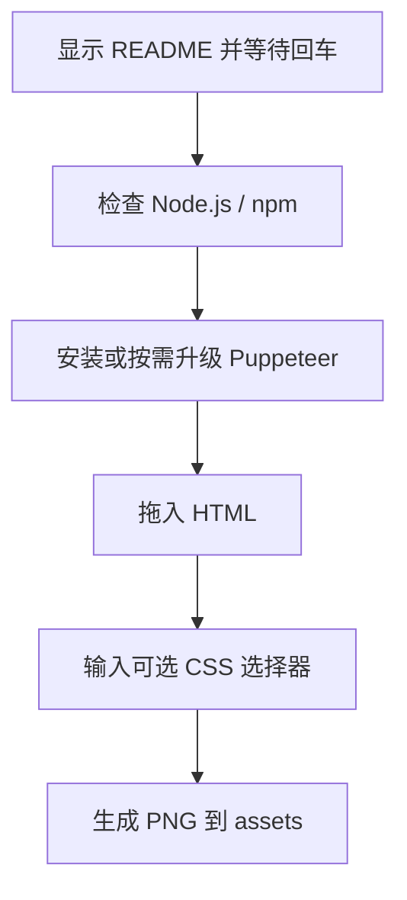

# `【MacOS】静态网页截全图.command` <a href="#前言" style="font-size:17px; color:green;"><b>🔼</b></a> <a href="#🔚" style="font-size:17px; color:green;"><b>🔽</b></a>


[toc]

## 🔥 <font id=前言>前言</font>

> 当前总行数：

* 🔧**工欲善其事必先利其器**

* 🌋 **站在巨人的肩膀上，才能看得更远**

* ✝️ **面向信仰编程**

* 🔔 **温馨提示**：这个自述文件和同目录脚本是一一对应关系。双击脚本后，会先打印本文件内容并阻塞等待回车，避免误操作。

* 脚本日志默认写入：

  ```shell
  /tmp/【MacOS】静态网页截全图.log
  ```

## 一、🎯 脚本定位 <a href="#前言" style="font-size:17px; color:green;"><b>🔼</b></a> <a href="#🔚" style="font-size:17px; color:green;"><b>🔽</b></a>

**静态 HTML 网页截图脚本**

用于把本地 HTML 文件用 Puppeteer 渲染并输出 PNG。可整页截图，也可输入 CSS 选择器精准截图。

## 二、🧩 适用场景 <a href="#前言" style="font-size:17px; color:green;"><b>🔼</b></a> <a href="#🔚" style="font-size:17px; color:green;"><b>🔽</b></a>

* 把本地 timeline.html 导出成长图。
* 需要截图某个固定 DOM 区块。
* Markdown README 需要配套网页截图素材。

## 三、🚀 快速开始 <a href="#前言" style="font-size:17px; color:green;"><b>🔼</b></a> <a href="#🔚" style="font-size:17px; color:green;"><b>🔽</b></a>

双击当前 `.command` 文件即可运行；也可以在终端中执行：

```shell
chmod +x './【MacOS】静态网页截全图.command'
./【MacOS】静态网页截全图.command
```

> 运行后先阅读终端打印的 README，确认无误后按回车继续。

## 四、🧭 工作流程 <a href="#前言" style="font-size:17px; color:green;"><b>🔼</b></a> <a href="#🔚" style="font-size:17px; color:green;"><b>🔽</b></a>



## 五、⚠️ 注意事项 <a href="#前言" style="font-size:17px; color:green;"><b>🔼</b></a> <a href="#🔚" style="font-size:17px; color:green;"><b>🔽</b></a>

* 首次安装 Puppeteer 需要联网。
* 复杂网页可能因为外链资源不可达而影响截图。
* 已有同名 PNG 时自动追加时间戳，避免覆盖。

## 六、📁 文件结构 <a href="#前言" style="font-size:17px; color:green;"><b>🔼</b></a> <a href="#🔚" style="font-size:17px; color:green;"><b>🔽</b></a>

```text
【MacOS】静态网页截全图.command/
├── 【MacOS】静态网页截全图.command
└── README.md
```

## 七、🪵 日志位置 <a href="#前言" style="font-size:17px; color:green;"><b>🔼</b></a> <a href="#🔚" style="font-size:17px; color:green;"><b>🔽</b></a>

```shell
/tmp/【MacOS】静态网页截全图.log
```

## 八、🍺 Homebrew 自检标准 <a href="#前言" style="font-size:17px; color:green;"><b>🔼</b></a> <a href="#🔚" style="font-size:17px; color:green;"><b>🔽</b></a>

凡是涉及 Homebrew 的脚本，统一执行以下规则：

| 场景 | 行为 |
|---|---|
| 未检测到 Homebrew | 按 CPU 架构安装：Apple Silicon 使用 `/opt/homebrew`，Intel 使用 `/usr/local` |
| 已检测到 Homebrew | 先写入并激活 `brew shellenv` |
| 询问是否更新 | 直接按 `[Enter]` = 跳过更新 |
| 询问是否更新 | 输入任意字符后回车 = 执行更新流程 |

更新流程固定为：

```shell
brew update
brew upgrade
brew cleanup
brew doctor
brew -v
```

其中 `brew update` / `brew upgrade` / `brew cleanup` 失败会直接停止；`brew doctor` 只作为健康检查，出现警告时按终端提示处理。

<a id="🔚" href="#前言" style="font-size:17px; color:green; font-weight:bold;">我是有底线的➤点我回到首页</a>
