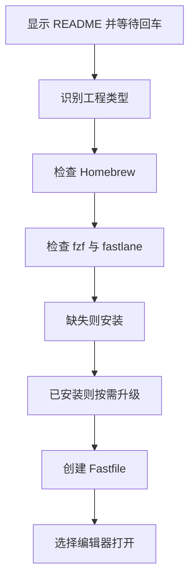

# `【MacOS】📦Fastfile.command` <a href="#前言" style="font-size:17px; color:green;"><b>🔼</b></a> <a href="#🔚" style="font-size:17px; color:green;"><b>🔽</b></a>


[toc]

## 🔥 <font id=前言>前言</font>

- 采用 Shell 脚本的原因：Shell 来自 [**macOS**](https://www.apple.com/macos/) 原生系统底层，虽然写法相对繁琐冗杂，但执行效率高，并且不需要额外介入 [**Ruby**](https://www.ruby-lang.org)、[**Python**](https://www.python.org) 等第三方运行环境，因此具备更好的移植性。

> 当前总行数：

- 🔧**工欲善其事必先利其器**

- 🌋 **站在巨人的肩膀上，才能看得更远**

- ✝️ **面向信仰编程**

- 🔔 **温馨提示**：这个自述文件和同目录脚本是一一对应关系。双击脚本后，会先打印本文件内容并阻塞等待回车，避免误操作。

- 脚本日志默认写入：

  ```shell
  /tmp/【MacOS】📦Fastfile.log
  ```

## 一、🎯 脚本定位 <a href="#前言" style="font-size:17px; color:green;"><b>🔼</b></a> <a href="#🔚" style="font-size:17px; color:green;"><b>🔽</b></a>

**Fastlane Fastfile 初始化脚本**

用于识别 Flutter / 原生 iOS 工程，安装或检查 fzf / fastlane，并创建 fastlane/Fastfile。

## 二、🧩 适用场景 <a href="#前言" style="font-size:17px; color:green;"><b>🔼</b></a> <a href="#🔚" style="font-size:17px; color:green;"><b>🔽</b></a>

- iOS 工程首次接入 Fastlane。
- Flutter 工程需要在 ios/fastlane 下生成 Fastfile。
- 需要用 Xcode / VSCode / Android Studio 打开 Fastfile。

## 三、🚀 快速开始 <a href="#前言" style="font-size:17px; color:green;"><b>🔼</b></a> <a href="#🔚" style="font-size:17px; color:green;"><b>🔽</b></a>

双击当前 `.command` 文件即可运行；也可以在终端中执行：

```shell
chmod +x './【MacOS】📦Fastfile.command'
./【MacOS】📦Fastfile.command
```

> 运行后先阅读终端打印的 README，确认无误后按回车继续。

## 四、🧭 工作流程 <a href="#前言" style="font-size:17px; color:green;"><b>🔼</b></a> <a href="#🔚" style="font-size:17px; color:green;"><b>🔽</b></a>



## 五、⚠️ 注意事项 <a href="#前言" style="font-size:17px; color:green;"><b>🔼</b></a> <a href="#🔚" style="font-size:17px; color:green;"><b>🔽</b></a>

- 会联网安装 Homebrew / fzf / fastlane。
- 已有 Fastfile 时不会覆盖。
- VSCode 命令行未安装也可尝试用 App 打开。

## 六、📁 文件结构 <a href="#前言" style="font-size:17px; color:green;"><b>🔼</b></a> <a href="#🔚" style="font-size:17px; color:green;"><b>🔽</b></a>

```text
【MacOS】📦Fastfile.command/
├── 【MacOS】📦Fastfile.command
└── README.md
```

## 七、🪵 日志位置 <a href="#前言" style="font-size:17px; color:green;"><b>🔼</b></a> <a href="#🔚" style="font-size:17px; color:green;"><b>🔽</b></a>

```shell
/tmp/【MacOS】📦Fastfile.log
```

## 八、🍺 Homebrew 自检标准 <a href="#前言" style="font-size:17px; color:green;"><b>🔼</b></a> <a href="#🔚" style="font-size:17px; color:green;"><b>🔽</b></a>

凡是涉及 Homebrew 的脚本，统一执行以下规则：

| 场景 | 行为 |
|---|---|
| 未检测到 Homebrew | 按 CPU 架构安装：Apple Silicon 使用 `/opt/homebrew`，Intel 使用 `/usr/local` |
| 已检测到 Homebrew | 先写入并激活 `brew shellenv` |
| 询问是否更新 | 直接按 `[Enter]` = 跳过更新 |
| 询问是否更新 | 输入任意字符后回车 = 执行更新流程 |

更新流程固定为：

```shell
brew update
brew upgrade
brew cleanup
brew doctor
brew -v
```

其中 `brew update` / `brew upgrade` / `brew cleanup` 失败会直接停止；`brew doctor` 只作为健康检查，出现警告时按终端提示处理。

<a id="🔚" href="#前言" style="font-size:17px; color:green; font-weight:bold;">我是有底线的➤点我回到首页</a>
